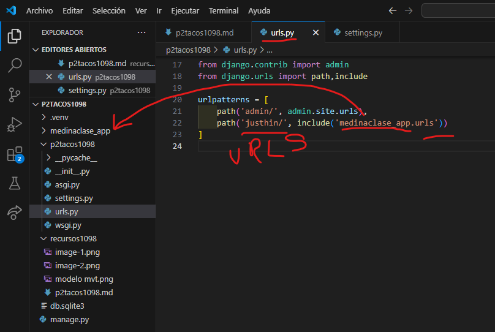

- crear aplicacion medinaclase_app
- comando --> python manage.py startapp medinaclase_app
- creamos el archivo urls.py en medina_app
- 
- en setting.py de p2tacos1098
- 
- en urls.py de p2tacos1098
- 
- en urls.py en medinaclase_app
- 
- en views.py en medinaclase_app
- 
- en urls.py en medinaclase_app
- 